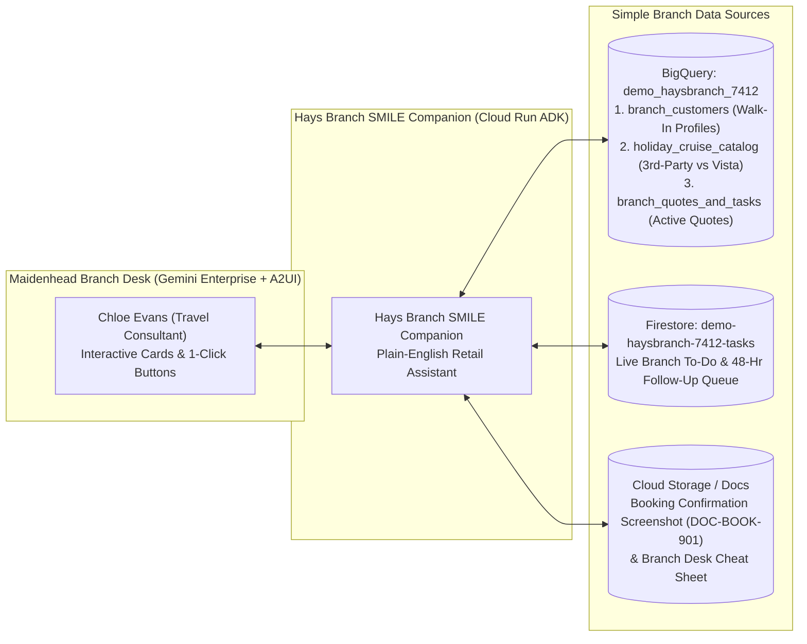

# Hays Branch SMILE Companion — Simple Retail Branch Demo Guide (`ge-demo-haysbranch-7412`)

| Resource | Details / Link (Sign in as `branch.manager@example.com`) |
| :--- | :--- |
| **Gemini Enterprise Agent** | **`Hays Branch SMILE Companion (ge-demo-haysbranch-7412)`** (Agent ID: `13984386720944190174`) |
| **Direct Live Chat Link** | `https://vertexaisearch.cloud.google.com/home/cid/7482972f-a29f-4bfe-ac7a-1efed3c6247f/r/agent/13984386720944190174/session/-` |
| **Branch To-Do Queue Viewer** | `https://ge-viewer-ge-demo-haysbranch-7412-izrmfecp5a-uc.a.run.app` |
| **BigQuery Dataset** | `merdogdu-sandbox-398713:demo_haysbranch_7412` (`branch_customers`, `holiday_cruise_catalog`, `branch_quotes_and_tasks`) |
| **Firestore Branch Tasks** | `demo-haysbranch-7412-tasks` (`TSK-BR-101` .. `TSK-BR-105`) |
| **GCS Booking Screenshots** | `gs://merdogdu-sandbox-398713-haysbranch-7412-docs/` |

> [!TIP]
> **The 3-Sentence Branch Pitch**
> Every day across Hays Travel’s 450+ retail branches, consultants lose **20 minutes** hunting through duplicate customer profiles in `iSell`, miss **+11% in extra Vista commission** because 3rd-party and in-house packages sit on separate tabs, and spend **10 minutes** re-typing supplier booking screens by hand.
> **Hays Branch SMILE Companion** puts a friendly Gemini Enterprise assistant right next to `iSell` that merges walk-in customer history in one second, surfaces veteran consultant tips alongside a live **3rd-Party vs. Vista commission comparison**, and auto-fills `iSell` + 48-hour follow-up tasks from a single booking screenshot.
> **Result:** A 45-minute branch consultation drops to **under 4 minutes**, customer savings go up, and branch commission doubles on switchable packages.

---

## 1. The 3-Step Branch Story ("A Walk-In at Maidenhead Branch")

You are playing **Chloe Evans**, Senior Retail Travel Consultant at **Hays Travel Maidenhead (`MAID-042`)**. It’s a busy Saturday morning, and **David & Sarah Henderson** have just walked in looking for a 14-night Canary Islands winter-sun cruise & stay for their 30th Wedding Anniversary.

| Step | What Happens Today (Without AI) | What Happens Live in Your Demo (With SMILE Companion) | Time / Margin Saved |
| :--- | :--- | :--- | :--- |
| **Step 1: Walk-In Customer Lookup** | Chloe searches *"David Henderson"* in `iSell` and finds **4 separate records** (typos, old postcode, Sarah's email). She spends 15–20 minutes piecing together their past trips and preferences. | Chloe types one sentence. **SMILE Companion** merges all 4 `iSell` profiles into a single **Walk-In Customer Card** showing **£28,450 lifetime spend**, **Mid-Ship Balcony** preference, **Gluten-Free (Coeliac)** alert for Sarah, and **£410 unspent `Sunny Spend` Euros**. | **~18 mins saved** at the start of the consultation |
| **Step 2: Holiday & Cruise Finder + Veteran Tips** | A newer consultant quotes a standard 3rd-party **TUI / P&O** package at **£6,290** (10.5% commission = **£660.45**) and accidentally picks Deck 8 (obstructed by lifeboat davits). | **SMILE Companion** compares **3rd-Party TUI (£6,290)** against **In-House Vista (`B629C` at £6,140)** side-by-side—saving the Hendersons **£150** while boosting Maidenhead branch commission from **£660.45 to £1,338.52 (+£678.07 extra)**—and flags the **Veteran Tip**: *"Book Deck 12 Mid-Ship (`B629C`), NOT Deck 8 above the lifeboats."* | **+£678.07 extra branch commission** + **£150 customer saving** |
| **Step 3: Screenshot-to-`iSell` & 48-Hr Follow-Up** | After booking on the supplier portal, Chloe spends **8–10 minutes** manually re-typing PNR references, flight numbers, and cabin codes into `iSell`, and forgets to add airport parking or a 48-hour courtesy call. | Chloe drops in the booking confirmation (`DOC-BOOK-901`). **SMILE Companion** extracts the PNR (`ARV-99412-PO`), Cabin (`C1204`), and flights (`TOM4122`), pre-fills `iSell` quote **`QT-MAID-901`**, attaches **Holiday Extras Gatwick Meet & Greet + Lounge**, and schedules the **48-hour anniversary call (`TSK-BR-101`)**. | **~10 mins saved** + **+£209 ancillary add-on** |

---

## 2. Simple Architecture & What Holds What Data

Unlike the enterprise HQ demo, this branch edition uses **only 3 simple tables**, **1 branch to-do list**, and **1 folder of booking screenshots**:



### The 3 BigQuery Tables (`merdogdu-sandbox-398713.demo_haysbranch_7412`)

| Table Name | What It Represents | Hero Records You Can Ask About |
| :--- | :--- | :--- |
| **`branch_customers`** | **One Clean Customer Card per Household** (merges duplicate `iSell` profiles, past trips, dietary/medical notes, and `Sunny Spend` FX card balance) | • **`CUST-101` — David & Sarah Henderson**: 4 merged `iSell` IDs, **£28,450** spend, 30th Anniversary, Mid-Ship Balcony, Sarah is Coeliac (Gluten-Free), **£410** on `Sunny Spend` card.<br/>• **`CUST-102` — Emma & Tom Miller**: Family of 4 (kids 6 & 9), wants soft-sand Spain beach with splash park under £3,500.<br/>• **`CUST-103` — Margaret & Arthur Pendelton**: Needs **68cm+ accessible cabin doorway** for folding mobility scooter. |
| **`holiday_cruise_catalog`** | **Side-by-Side Holiday & Cruise Catalog** (3rd-party supplier price/commission vs. Hays Vista in-house price/commission + **Veteran Consultant Tips**) | • **`B629C` — P&O Arvia 14N Canary Islands + Riu Palace Tenerife**: TUI **£6,290** (£660.45 comm) vs. Vista **£6,140** (**£1,338.52 comm = +£678.07 extra**) + Deck 12 vs. Deck 8 lifeboat tip.<br/>• **`FAM-TOR-402` — Sol Principe Torremolinos 4* Family Splash**: Jet2 **£3,390** vs. Vista **£3,240** (**+£341.40 extra comm**) + Veteran Tip: *"Flat soft sand in Torremolinos vs. stony beach in Marbella."*<br/>• **`CRU-IONA-510` — P&O Iona 7N Norwegian Fjords (Accessible)**: Confirmed **72cm doorway** + roll-in wet room from Southampton. |
| **`branch_quotes_and_tasks`** | **Active Maidenhead Branch Quotes (`iSell`)** (tracks manual re-keying minutes saved, ancillary add-ons, and 48-hr follow-up status) | • **`QT-MAID-901`**: David & Sarah Henderson (`B629C` Canary Islands Cruise & Stay).<br/>• **`QT-MAID-902`**: Emma & Tom Miller (`FAM-TOR-402` Torremolinos Family Beach).<br/>• **`QT-MAID-903`**: Margaret & Arthur Pendelton (`CRU-IONA-510` Accessible Fjords Cruise). |

### Live Branch To-Do Queue (`Firestore: demo-haysbranch-7412-tasks`)
* **`TSK-BR-101`**: *Henderson 30th Anniversary — Auto-Fill `iSell` from `DOC-BOOK-901` & Schedule 48-Hr Follow-Up Call* (`REQUIRES_ACTION`)
* **`TSK-BR-102`**: *Miller Family (`CUST-102`) — Switch Quote `QT-MAID-902` to Vista Torremolinos Soft-Sand Package (`FAM-TOR-402`)* (`REQUIRES_ACTION`)
* **`TSK-BR-103`**: *Pendelton Accessible Cruise (`CUST-103`) — Confirm 72cm Cabin Doorway on P&O Iona (`CRU-IONA-510`)* (`IN_PROGRESS`)

---

## 3. Copy-Paste Prompt Playbook (3 Core Prompts + 1 Bonus Prompt)

### Prompt 1 — Walk-In Customer Card (Kills the 20-Minute `iSell` Search)
> **Say to the customer:** *"Let’s see what happens when David and Sarah Henderson walk into the Maidenhead branch. Chloe doesn't know any customer IDs—she just types their names:"*

```text
David and Sarah Henderson just walked into the Maidenhead branch for their 30th anniversary trip. Pull up their unified customer card—how many duplicate iSell records did we merge, what did they love on past trips, any dietary or cabin notes, and what is on their Sunny Spend card?
```

**What to point out on screen:**
* Automatically resolves *"David and Sarah Henderson"* (`CUST-101`) and merges **4 duplicate `iSell` profiles** (`ISELL-88210, ISELL-88214, ISELL-90102, ISELL-94311`) into one clean **A2UI Customer Card**.
* Highlights **£28,450 lifetime spend**, **Mid-Ship Balcony** preference, **Sarah’s Coeliac (Gluten-Free)** note, and **£410 already loaded** on their `Sunny Spend` card.

---

### Prompt 2 — Natural-Language Holiday & Cruise Finder + Vista Commission Boost
> **Say to the customer:** *"Now let’s find their holiday—plus a Spain beach trip for the Miller family waiting at the next desk—using plain English:"*

```text
Compare our best 14-night Canary Islands cruise-and-stay options for David & Sarah Henderson, and also check our best soft-sand Spain family beach option under £3,500 for Emma & Tom Miller. Show the 3rd-party supplier price vs our Hays Vista price, how much extra branch commission we earn, and the Veteran Consultant Tips!
```

**What to point out on screen:**
* **For the Hendersons (P&O Arvia + Riu Palace Tenerife — `B629C`):**
  * **3rd-Party (TUI):** £6,290 total | £660.45 branch commission (10.5%)
  * **Hays Vista In-House:** **£6,140 total (£150 cheaper for the customer!)** | **£1,338.52 branch commission (21.8% = +£678.07 extra for the branch!)**
  * **Veteran Tip:** *"Book Mid-Ship Deck 12, NOT Deck 8 (lifeboat davit overhang blocks the downward sea view) — and pre-log Coeliac dining at The Olive Grove."*
* **For the Miller Family (Sol Principe Torremolinos — `FAM-TOR-402`):**
  * Saves the family **£150** (£3,240 vs. £3,390), earns **+£341.40 extra branch commission**, and warns the consultant that **Torremolinos Playamar has flat soft sand and shallow water**, whereas **Marbella has stony beaches and a steep drop-off**.

---

### Prompt 3 — 1-Click Screenshot-to-`iSell` Auto-Fill & 48-Hr Courtesy Task
> **Say to the customer:** *"Finally, once the Hendersons say yes, Chloe doesn't type PNR codes or task IDs—she just asks the Companion to process their P&O Arvia booking confirmation and schedule their 48-hour follow-up call:"*

```text
We just received the P&O Arvia & Vista booking confirmation for David & Sarah Henderson. Extract the booking reference, cabin number, and flight details to auto-fill iSell, add their Holiday Extras Gatwick Meet & Greet parking and lounge, and mark their 48-hour anniversary follow-up task as scheduled.
```

**What to point out on screen:**
* Automatically locates their confirmation (`DOC-BOOK-901`), quote (`QT-MAID-901`), and branch task (`TSK-BR-101`) by customer name (`PNR: ARV-99412-PO`, Cabin `C1204` Deck 12 Mid-Ship, Flights `TOM4122 / TOM4123` LGW–TFS).
* Updates Firestore task **`TSK-BR-101`** live in the **Branch To-Do Queue Viewer** and eliminates **9 minutes of manual `iSell` re-keying**.

---

### Bonus Prompt 4 — Accessible Cruise Cabin Check (Instant Specialist Knowledge)
```text
Margaret and Arthur Pendelton need a no-fly cruise from Southampton where the cabin doorway is wide enough for Arthur's folding mobility scooter. Which cruise in our catalog fits them best, and what is the status of their branch follow-up task?
```
*(Automatically finds `CRU-IONA-510` — P&O Iona 7-Night Norwegian Fjords with a verified **72cm wide accessible doorway**, roll-in wet room, and level gangway access at Southampton Mayflower Terminal.)*
