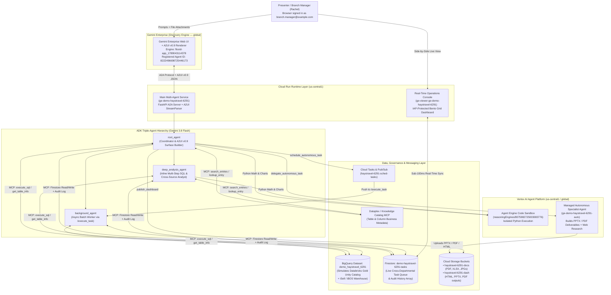

# Hays Travel Gemini Enterprise & A2UI v0.9 Demo — Architecture, Data Map & Presenter Story Guide

> [!IMPORTANT]
> **Live Demo Access (`branch.manager@example.com` in `merdogdu-sandbox-398713`)**
> - **Gemini Enterprise Live Chat (`Hays Travel SMILE Sidekick`)**: [Open Agent Chat](https://vertexaisearch.cloud.google.com/home/cid/7482972f-a29f-4bfe-ac7a-1efed3c6247f/r/agent/8222496698725446173/session/-)
> - **Real-Time Operations Console (Firestore Viewer)**: [Open Operations Console](https://ge-viewer-ge-demo-haystravel-6291-izrmfecp5a-uc.a.run.app)
> - **External Sample Files Bucket (PDF, Excel, Scanned Consultation Sheets)**: [Open GCS Bucket](https://console.cloud.google.com/storage/browser/merdogdu-sandbox-398713-haystravel-6291-docs?project=merdogdu-sandbox-398713)
> - **BigQuery Dataset (`demo_haystravel_6291`)**: [Open BigQuery](https://console.cloud.google.com/bigquery?referrer=search&project=merdogdu-sandbox-398713&ws=!1m4!1m3!3m2!1smerdogdu-sandbox-398713!2sdemo_haystravel_6291)

---

## 1. The Customer Story: "From Maidenhead High Street to Gilbridge House HQ"

### Why This Story Resonates with Hays Travel
When we shadowed **Rachel** at the **Maidenhead branch (`MAID-042`)** and reviewed the data estate with **Oliver Grant (Head of Data)** and the Sunderland team, one core tension stood out:

1. **Hays Travel's superpower is human warmth and trust on the high street**—450+ retail branches and homeworkers building lifelong relationships with families like **David & Sarah Henderson**.
2. **Yet the technology behind the desk forces agents to act like human APIs.** While a customer sits across the desk in Maidenhead:
   - Searching a surname in legacy **`iSell`** returns **40+ unmerged duplicate profiles** because `iSell` has no input validation or household entity resolution.
   - Quoting a complex cruise + stay itinerary (like **P&O *Arvia* voyage code `B629C`**) takes **2+ hours** of copy-pasting across P&O's Complete Cruise Solution, Travelport GDS, Bedsonline, and TUI portals.
   - Because building an in-house **Vista Dynamic Package** is manual and slow, time-pressed consultants default to selling a **3rd-party TUI package at ~10.5% commission** instead of an in-house **Vista package at 21.8% margin**—leaving **£678+ of pure margin** on the table on a single booking.
   - Downstream in **Gilbridge House HQ (Sunderland)**, Commercial Finance has to manually reconcile **`iBOS`** back-office settlements against supplier extranet invoices (where unmapped hotel aliases like `"HTL RIU PALACE TENERIFE ADEJE"` and fuel/bedbank supplements create **5–15% variances**) and hunt down **"Audit Genie" anomalies** where branch staff push a cancelled booking's departure date forward by **+12 months** to delay commission clawbacks.

### The Narrative Arc You Tell in the Room (The "Golden Thread")
> *"Today we're going to follow a single customer consultation from the moment **David and Sarah Henderson** walk into **Rachel's Maidenhead branch (`MAID-042`)** asking about **P&O Arvia cruise code `B629C`**, all the way through to the **Vista Specialist Desk** and **Sunderland HQ Commercial Finance**. Instead of ripping and replacing Databricks or `iBOS`, we'll show how **Gemini Enterprise + A2UI v0.9** acts as the intelligent front-end for Hays Travel's new **`SMILE`** platform—turning a 2-hour fragmented search into a 90-second interactive conversation that doubles branch commission and closes the back-office audit loop automatically."*

```mermaid
flowchart LR
    subgraph Act1["Act 1: Maidenhead Branch (MAID-042)"]
        P0["Greeting & Welcome Card<br/>(Rachel's SMILE Workspace)"] --> P1["Prompt 1: Customer 360 & B629C<br/>(4 iSell Duplicates -> 1 Gold SCV<br/>10.5% TUI -> 21.8% Vista +£678)"]
    end
    subgraph Act2["Act 2: Data & Commercial Governance"]
        P1 --> P2["Prompt 2: Unity Catalog Lineage<br/>(Governed Schema & Margin Rules)"]
        P2 --> P3["Prompt 3: Cross-Source Audit Genie<br/>(PDF + Excel vs. BigQuery iBOS<br/>+£420 Variance & +12M Deferrals)"]
    end
    subgraph Act3["Act 3: Attended Extranet & Batch Action"]
        P3 --> P4["Prompt 4: Vision Scan + A2UI Batch Editor<br/>(Scan DOC-MAID-8841 -> MDM Resolve<br/>Human-in-the-Loop Approve -> Firestore)"]
    end
    subgraph Act4["Act 4: Executive Scale & Automation"]
        P4 --> P5["Prompt 5: Autonomous Sandbox Agent<br/>(Board PPTX + PDF Margin Playbook)"]
        P5 --> P6["Prompt 6: 09:00 AM Cron Monitor<br/>(Daily Audit Genie & Vista Alert)"]
        P6 --> P7["Prompt 7: COO Executive Closure<br/>(135 min -> 90 sec | Full Audit Trail)"]
    end
```



---

## 2. System Architecture & Which Components Hold What Data

### High-Level Technical Architecture



---

### Component-by-Component Data Inventory

Use this quick-reference map whenever the customer asks *"Where is that number coming from?"* or *"How does this map to our Databricks / iSell / iBOS stack?"*

| GCP Component in Demo | Resource Name / Location | What It Represents in Hays Travel's Estate | Exact Data & Hero Records Stored Inside |
| :--- | :--- | :--- | :--- |
| **BigQuery Table 1:**<br/>`gold_customer_scv` | `merdogdu-sandbox-398713`<br/>`.demo_haystravel_6291`<br/>`.gold_customer_scv`<br/>*(55 rows, US)* | **Databricks Gold Single Customer View (SCV)**<br/>*(Oliver Grant's Tier 3 Master Data / Entity Resolution across `iSell`)* | • **PK**: `scv_household_id`<br/>• **Hero Household**: **`SCV-HH-84920`** (**David & Sarah Henderson**, Maidenhead Branch `MAID-042`)<br/>• **Merged Duplicates**: `legacy_isell_duplicate_count = 4` (`ISELL-44012, ISELL-44089, ISELL-51204, ISELL-60911`)<br/>• **Value & Preferences**: `lifetime_spend_gbp = £28,450.00`, `bookings_last_36m = 6`, `preferred_cabin_grade = Balcony Deluxe`, `preferred_departure_port_or_airport = Southampton / London Gatwick`, `dietary_accessibility_notes = Gluten-free dining; mid-ship cabin preferred`<br/>• **AI Propensity Scores**: `cancellation_risk_score = 0.74` (`High`), `vista_affinity_score = 0.92`, `recommended_next_product_id = PRD-B629C` |
| **BigQuery Table 2:**<br/>`supplier_product_mdm` | `merdogdu-sandbox-398713`<br/>`.demo_haystravel_6291`<br/>`.supplier_product_mdm`<br/>*(50 rows, US)* | **Master Data Management (MDM) Cruise & Vista Product Catalog**<br/>*(Resolves P&O / Bedsonline / Hotelbeds strings + compares 3rd-Party vs. Vista margins)* | • **PK**: `canonical_product_id`<br/>• **Hero Product**: **`PRD-B629C`** (Voyage Code **`B629C`** — *P&O Arvia 14N Canary Islands & Madeira Fly/Cruise + Vista 3N Riu Palace Tenerife Stay*)<br/>• **Raw Supplier Strings**: `"HTL RIU PALACE TENERIFE / RIU PALACE ADEJE 5* / P&O ARVIA BALCONY DELUXE"` $\rightarrow$ Canonical: `"P&O Arvia (B629C) + Hotel Riu Palace Tenerife 5* (Costa Adeje)"`<br/>• **3rd-Party Economics (TUI)**: Gross `£6,290.00` \| Commission **`10.5%` (`£660.45`)**<br/>• **Vista Dynamic Package Economics**: Gross **`£6,140.00`** (**saves client £150.00**) \| Net Supplier Cost `£4,801.48` \| Vista Margin **`21.8%` (`£1,338.52`)** \| **Margin Uplift: `+£678.07`** |
| **BigQuery Table 3:**<br/>`isell_bookings_inquiries` | `merdogdu-sandbox-398713`<br/>`.demo_haystravel_6291`<br/>`.isell_bookings_inquiries`<br/>*(65 rows, US)* | **`iSell` Branch POS Quotes + `iBOS` Back-Office Finance Settlement + Audit Genie Flags** | • **PK**: `booking_ref` \| **FKs**: `scv_household_id`, `canonical_product_id`<br/>• **Hero Quote (`HT-884120`)**: Maidenhead (`MAID-042`), Consultant **Rachel**, Household `SCV-HH-84920`, Product `PRD-B629C`, Status `Quote_Ready_For_Vista_Switch`, `iBOS` Settled Net Cost `£4,801.48` vs. Supplier Extranet Invoiced `£5,221.48` (**`+£420.00` variance**)<br/>• **Hero Audit Genie `+12M` Deferral Flags** (`departure_date_deferral_months = 12`, `booking_status = Deferred_Suspect_Cancellation`):<br/>  1. **`HT-884105`** (`MAID-042`, `SCV-HH-84925`, `PRD-B629C`, Variance **`+£445.00`**)<br/>  2. **`HT-884112`** (`MAID-042`, `SCV-HH-84928`, `PRD-G711M`, Variance **`+£495.00`**)<br/>  3. **`HT-884119`** (`SUND-001`, `SCV-HH-84931`, `PRD-A305P`, Variance **`+£390.00`**) |
| **Knowledge Catalog (Dataplex)** | Attached to `demo_haystravel_6291` tables | **Unity Catalog Governance & Semantic Definitions** | Holds table-level business descriptions (`*_description.txt`) and column-level schema descriptions (`*_schema.json`) queried via MCP (`search_entries`, `lookup_entry`, `get_table_info`). |
| **Firestore Operational Queue** | Collection:<br/>`demo-haystravel-6291-tasks`<br/>*(+ Data Viewer Console)* | **Cross-Departmental Workflow & Audit Trail**<br/>*(Maidenhead Branch $\leftrightarrow$ Vista Desk $\leftrightarrow$ Sunderland HQ)* | **5 Seeded Operational Tasks** (each with an immutable `history` array of departmental hand-offs):<br/>• **`TSK-HT-6291`**: Henderson Family (`HT-884120`) — Vista Package Switch & `+£420` Extranet Rate Reconciliation<br/>• **`TSK-HT-6292`**: Audit Genie Alert — `+12M` Artificial Departure Deferral (`HT-884105`, `+£445`)<br/>• **`TSK-HT-6293`**: PTC Lead Support O2O Handover & Deferral Review (`HT-884112`, `+£495`)<br/>• **`TSK-HT-6294`**: Hotel MDM Deduplication Batch — 189 Riu Palace Tenerife Supplier Extranet Aliases (`PRD-B629C`)<br/>• **`TSK-HT-6295`**: Vista Ticketing, ATOL Certificate Issuance & Deferral Audit (`HT-884119`, `+£390`) |
| **Cloud Storage (`-docs` bucket)** | `gs://merdogdu-sandbox-398713-haystravel-6291-docs/` | **Unstructured Supplier Extranet & Branch Documents** | 1. **`haystravel_audit_report.pdf`**: Sunderland HQ Q3 FY26 Commercial Finance & Audit Genie Report<br/>2. **`haystravel_external_ledger.xlsx`**: P&O & Bedsonline Supplier Extranet Settlement Ledger (50 rows with exact net invoice amounts)<br/>3. **`haystravel_simulated_order_task1.jpg`** (`DOC-MAID-8841`): Scanned Maidenhead `"SMILE"` Consultation & Vista Quote Sheet for `HT-884120`<br/>4. **`haystravel_simulated_order_task2_discrepancy.jpg`** (`DOC-PTCLS-8849`): Scanned Supplier Extranet Contract Amendment & `iBOS` Exception Voucher (`+£420.00` mismatch & raw hotel string) |
| **Cloud Storage (`-dash` bucket)** | `gs://merdogdu-sandbox-398713-haystravel-6291-dash/` | **Generated Interactive Dashboards & Board Deliverables** | Stores self-contained interactive HTML dashboards (`publish_dashboard`), autonomous agent `.pptx` slide decks, `.pdf` board briefs, and mounted craft skill packs (`/workspace/.agent/skills`). |

---

## 3. Complete Prompt Playbook (Core 7-Step Flow + Bonus Live Q&A Prompts)

### Pre-Demo Setup Checklist (60 Seconds Before Presenting)
1. Open **Tab 1**: [Gemini Enterprise Live Chat (`Hays Travel SMILE Sidekick`)](https://vertexaisearch.cloud.google.com/home/cid/7482972f-a29f-4bfe-ac7a-1efed3c6247f/r/agent/8222496698725446173/session/-)
2. Open **Tab 2**: [Firestore Real-Time Operations Console](https://ge-viewer-ge-demo-haystravel-6291-izrmfecp5a-uc.a.run.app) (keep this open side-by-side or on a second tab to show live state updates during Prompt 4 and Prompt 7).
3. Download the **4 external files** to your laptop's Downloads folder so you can drag-and-drop them into the chat during Prompts 3 and 4:
   - [`haystravel_audit_report.pdf`](https://storage.cloud.google.com/merdogdu-sandbox-398713-haystravel-6291-docs/haystravel_audit_report.pdf)
   - [`haystravel_external_ledger.xlsx`](https://storage.cloud.google.com/merdogdu-sandbox-398713-haystravel-6291-docs/haystravel_external_ledger.xlsx)
   - [`haystravel_simulated_order_task1.jpg`](https://storage.cloud.google.com/merdogdu-sandbox-398713-haystravel-6291-docs/haystravel_simulated_order_task1.jpg)
   - [`haystravel_simulated_order_task2_discrepancy.jpg`](https://storage.cloud.google.com/merdogdu-sandbox-398713-haystravel-6291-docs/haystravel_simulated_order_task2_discrepancy.jpg)

---

### Step 0: The Opening Greeting (Instant A2UI v0.9 Welcome Card)
- **What to say to the customer**: *"Let's start at the Maidenhead branch desk with Rachel. When Rachel opens the new SMILE Sidekick in Gemini Enterprise and says hello, notice it doesn't just return a wall of text—it renders a native A2UI v0.9 workspace card with one-click actions."*
- **Prompt to type**:
  ```text
  Hello
  ```
- **What happens**: Without calling any database tools, `root_agent` returns a warm greeting and renders the `welcome-card` surface with 3 action buttons tailored to Hays Travel.

---

### Prompt 1: Maidenhead Branch (`SMILE`) — Customer 360 Lookup, Cruise `B629C` Killer & Interactive Margin Simulator
- **Story Beat**: David & Sarah Henderson walk into Maidenhead (`MAID-042`) asking about quote `HT-884120` for P&O *Arvia* voyage `B629C`. In legacy `iSell`, Rachel would face 4 duplicate profiles and 2 hours of portal searching.
- **Attachments**: None (queries BigQuery `gold_customer_scv`, `supplier_product_mdm`, `isell_bookings_inquiries`).
- **Prompt to copy/paste**:
  ```text
  David and Sarah Henderson (Household ID SCV-HH-84920) have just walked into our Maidenhead branch (MAID-042) asking about quote HT-884120 for P&O Arvia cruise voyage code B629C. Give me their unified Databricks Gold Customer 360 profile—including how many legacy iSell duplicate records were merged and their cancellation risk—compare the 3rd-party TUI package against our in-house Vista Dynamic Package for PRD-B629C, and build an interactive HTML margin & branch KPI dashboard so we can review the commission uplift across our top cruise and Vista packages.
  ```
- **Key Numbers the Agent Will Surface**:
  - **Unified SCV (`SCV-HH-84920`)**: Consolidated **4 legacy `iSell` duplicates** (`ISELL-44012, 44089, 51204, 60911`), **£28,450.00** lifetime spend, **Balcony Deluxe** preference, **0.74 High** cancellation risk.
  - **Cruise `B629C` vs. Vista (`PRD-B629C`)**: 3rd-party TUI package is **£6,290.00** at **10.5% commission (£660.45)**; in-house **Vista Dynamic Package** is **£6,140.00** (**saving the Hendersons £150.00**) at **21.8% margin (£1,338.52)**—an instant **+£678.07 commission uplift**.
  - **Interactive Dashboard**: Publishes a live signed HTML dashboard (`publish_dashboard`) that opens directly in the browser.

---

### Prompt 2: Sunderland Data Governance — Unity Catalog & BigQuery Metadata Discovery
- **Story Beat**: Oliver Grant's team needs assurance that branch agents and AI aren't guessing column definitions—every metric (`vista_margin_uplift_gbp`, `departure_date_deferral_months`, `ibos_variance_gbp`) is governed in the catalog.
- **Attachments**: None (queries Knowledge Catalog MCP `search_entries` / `lookup_entry`).
- **Prompt to copy/paste**:
  ```text
  Before we roll out the new SMILE and Vista margin rules across all branches, inspect the Knowledge Catalog metadata for our demo_haystravel_6291 dataset. Explain the schema lineage and primary/foreign key relationships between gold_customer_scv, supplier_product_mdm, and isell_bookings_inquiries, and summarize how vista_margin_uplift_gbp, departure_date_deferral_months, and ibos_variance_gbp are governed across Maidenhead and Sunderland HQ.
  ```
- **What to highlight**: Point out that the agent queries the **Knowledge Catalog metadata layer** to verify exact join keys (`scv_household_id`, `canonical_product_id`, `booking_ref`) and business definitions.

---

### Prompt 3: Sunderland HQ "Audit Genie" — Cross-Source PDF + Excel Extranet vs. BigQuery `iBOS` Reconciliation [WOW MOMENT]
- **Story Beat**: Now we shift from Maidenhead's front desk to **Gilbridge House HQ in Sunderland**. Commercial Finance receives the P&O / Bedsonline Supplier Extranet Ledger (`.xlsx`) and the Q3 Audit Genie Report (`.pdf`). Can Gemini cross-reference those external files against live `iBOS` data in BigQuery automatically?
- **Attachments**: Attach **`haystravel_audit_report.pdf`** + **`haystravel_external_ledger.xlsx`**.
- **Prompt to copy/paste**:
  ```text
  Cross-reference the attached Sunderland HQ Audit Genie report and P&O / Bedsonline Supplier Extranet Settlement Ledger against our live BigQuery isell_bookings_inquiries and supplier_product_mdm tables. Identify every booking with an untracked 5-15% net cost variance between iBOS and the supplier extranet—including the Hendersons' quote HT-884120—and flag all bookings exhibiting the +12-month artificial departure date deferral pattern. Render a visual executive comparison and discrepancy breakdown.
  ```
- **Key Numbers the Agent Will Surface**:
  - **`HT-884120` (Hendersons, `MAID-042`)**: `iBOS` settled net cost **`£4,801.48`** vs. Supplier Extranet invoice **`£5,221.48`** $\rightarrow$ **`+£420.00` variance** (unapplied seasonal bedbank & fuel supplement).
  - **3 Audit Genie `+12-Month` Artificial Departure Deferrals** (`departure_date_deferral_months = 12`):
    1. **`HT-884105`** (`MAID-042`): `+£445.00` variance
    2. **`HT-884112`** (`MAID-042`): `+£495.00` variance
    3. **`HT-884119`** (`SUND-001`): `+£390.00` variance
  - **Total Hero Variance Identified**: **£1,750.00** across the 4 flagged hero bookings (plus generates a visual discrepancy infographic via `generate_image`).

---

### Prompt 4: Attended Extranet Vision & Human-in-the-Loop A2UI Batch Editor [WOW MOMENT]
- **Story Beat**: Hays Travel lacks APIs for many specialist extranets and relies on screenshots, PDFs, and paper consultation sheets. Here we attach a scanned Maidenhead consultation sheet (`DOC-MAID-8841`) and supplier voucher (`DOC-PTCLS-8849`) containing messy hotel text (`"HTL RIU PALACE TENERIFE ADEJE"`). Gemini reads the image, resolves the hotel to canonical MDM ID `PRD-B629C`, and presents an **interactive A2UI Batch Editor form** so a human approves the database write.
- **Attachments**: Attach **`haystravel_simulated_order_task1.jpg`** (and optionally **`haystravel_simulated_order_task2_discrepancy.jpg`**).
- **Prompt to copy/paste**:
  ```text
  Please scan this Maidenhead SMILE consultation sheet and supplier extranet contract voucher. Extract the booking reference, voyage code, and raw hotel string ("HTL RIU PALACE TENERIFE ADEJE"), resolve them against our canonical supplier_product_mdm catalog (PRD-B629C), and prepare an interactive Batch Editor card so I can approve converting HT-884120 to our in-house Vista Dynamic Package, reconciling the +£420.00 extranet variance, and advancing task TSK-HT-6291 on the Operations Console.
  ```
- **Live Interaction**:
  1. Review the rendered **A2UI v0.9 Batch Editor / Interactive Form** card in chat.
  2. Click the **Approve / Execute** button on the card.
  3. Switch to **Tab 2 ([Operations Console](https://ge-viewer-ge-demo-haystravel-6291-izrmfecp5a-uc.a.run.app))** and watch **`TSK-HT-6291`** update in real time with the new audit `history` entry!

---

### Prompt 5: Head of Vista Operations — Autonomous Sandbox Delegation (Board `.pptx` & `.pdf`) [WOW MOMENT]
- **Story Beat**: Now the Head of Vista wants a board-ready PowerPoint deck and PDF brief for the Gilbridge House Executive Board combining live internal BigQuery numbers with external UK ATOL market research.
- **Attachments**: None (invokes `delegate_autonomous_task` on `ge-demo-haystravel-6291-auto`).
- **Prompt to copy/paste**:
  ```text
  Using our live BigQuery figures for Maidenhead (MAID-042), Sunderland (SUND-001), and the Henderson household case (SCV-HH-84920 / HT-884120 / PRD-B629C), delegate to the autonomous specialist agent to research current UK ATOL dynamic packaging market trends and build both an executive PowerPoint presentation (.pptx) and a formal PDF Commercial Governance Brief (.pdf) for the Gilbridge House Executive Board quantifying the commission uplift from shifting 3rd-party bookings to Vista Dynamic Packages and eliminating +12-month departure deferrals.
  ```
- **What happens**: The conversational agent queries BigQuery first, bundles the authoritative numbers into `INPUT DATA`, and delegates to the **Managed Autonomous Sandbox Agent**, which writes a multi-phase `plan.md`, builds charts, generates `.pptx` and `.pdf` files, uploads them to Cloud Storage, and returns clickable download links.

---

### Prompt 6: Sunderland HQ Audit Genie — Scheduled Daily `09:00 AM` Automated Governance
- **Story Beat**: Instead of waiting for quarterly audits, Sunderland HQ turns this exact check into a proactive daily `09:00 AM` cron job.
- **Attachments**: None (registers recurring cron via `schedule_autonomous_task` and Pub/Sub `haystravel-6291-sched-tasks`).
- **Prompt to copy/paste**:
  ```text
  Set up an automated recurring Audit Genie & Vista Margin monitoring job to run every morning at 09:00 AM UK time (cron: 0 9 * * *). It should scan isell_bookings_inquiries and supplier_product_mdm for any booking whose departure date was pushed forward by 12 months (departure_date_deferral_months >= 12), any iBOS vs. supplier extranet variance exceeding £250, or any high-value quote eligible for a Vista Dynamic Package upgrade, and automatically log tasks to the Sunderland HQ and retail branch operations queue.
  ```

---

### Prompt 7: Chief Operating Officer — End-to-End Branch-to-HQ Executive Closure
- **Story Beat**: Close the loop across all 3 personas—showing the before/after consultation speed (**135 mins $\rightarrow$ 90 seconds**), total `iSell` duplicates eliminated, total Vista margin unlocked, and full resolution of the Firestore task queue.
- **Attachments**: None.
- **Prompt to copy/paste**:
  ```text
  Provide a comprehensive end-to-end executive closure report for the Maidenhead (MAID-042) to Sunderland HQ workflow we just executed—following David & Sarah Henderson (SCV-HH-84920 / HT-884120 / B629C) and the Audit Genie batch (HT-884105, HT-884112, HT-884119). Quantify the before-and-after cycle time per consultation, total legacy iSell duplicates consolidated across our 55 Gold households, total Vista commission uplift in GBP across our 50 catalog products, and total iBOS extranet variance reconciled, and update all remaining open tasks in our Firestore operations queue with a final executive audit log.
  ```

---

## 4. Bonus Ad-Hoc Prompts You Can Ask Anytime During Q&A

If the customer asks to go off-script or explore specific areas of their business (e.g., **Personal Travel Consultants / O2O lead routing**, **branch-by-branch comparisons**, or **hotel MDM deduplication**), you can ask any of these live:

### A. Branch League Table & Vista Conversion Opportunity
```text
Compare our retail branches (Maidenhead MAID-042, Sunderland SUND-001, Newcastle NEWC-015, Leeds LEED-022, Manchester MANC-031, and Bournemouth BOUR-019) by total gross booking value, average expected commission percentage, and total iBOS extranet variance in GBP. Which branch has the biggest immediate commission uplift opportunity from switching 3rd-party quotes to Vista Dynamic Packages?
```

### B. High Churn / Cancellation Risk VIP Households ("Save the Booking")
```text
Query gold_customer_scv for all households with a cancellation_risk_score above 0.65 and lifetime_spend_gbp over £15,000. Match each household to their recommended_next_product_id in supplier_product_mdm and show me a prioritized retention table with the exact Vista package we should offer them and the commission uplift in GBP.
```

### C. Hotel & Cruise Ship MDM Deduplication Deep-Dive
```text
Show me the top 10 products in supplier_product_mdm with the highest vista_margin_uplift_gbp, including their raw_supplier_hotel_strings vs. canonical_hotel_or_ship_name, remaining_vista_allocation, and how much more commission we earn in GBP compared to TUI, Jet2holidays, or EasyJet Holidays.
```

### D. Live Operational Queue Inspection (Firestore)
```text
List all 5 operational tasks currently in our Firestore queue (TSK-HT-6291 through TSK-HT-6295) with their assigned department, risk level, financial impact in GBP, and full departmental hand-off history.
```
