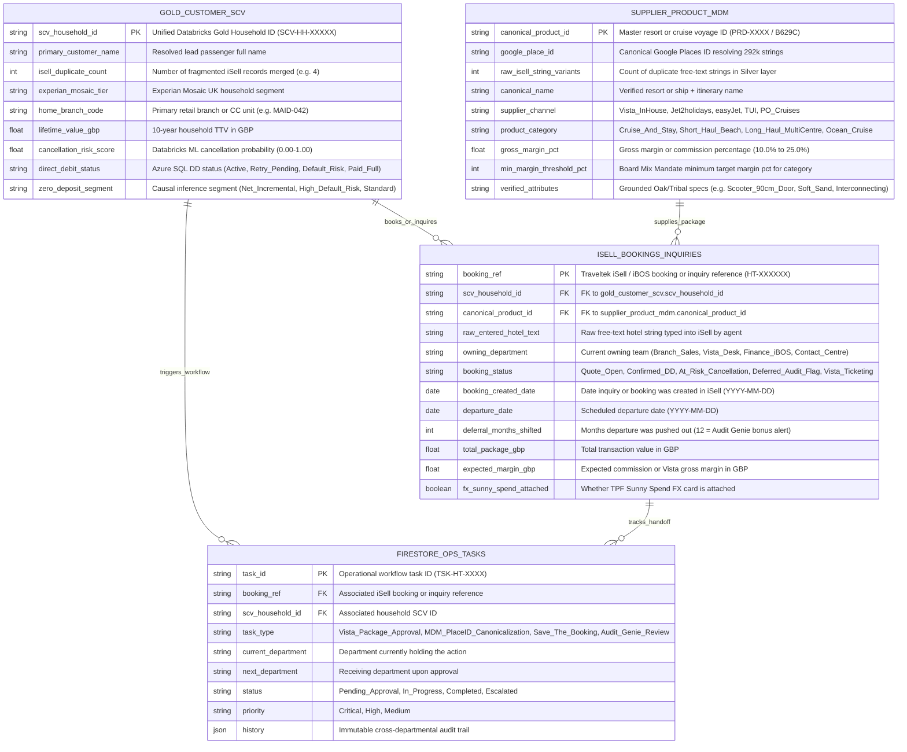

# Hays Travel — Gemini Enterprise & Interactive A2UI Demo Ideas & Flagship Blueprint

> [!IMPORTANT]
> **Executive Framing for the 6 October Sunderland Playback & 9 November Antalya Conference**
> Hays Travel does **not** want a self-serve OTA checkout to replace its 3,500 frontline consultants (`68.44%` of bookings happen in retail branches at `~40%` conversion vs. `0.64%` on `haystravel.co.uk`). Every demo idea below follows the **"Co-Exist, Augment & Decouple"** principle requested by Group CTO **Oliver Grant**—keeping **Traveltek (`iSell` / `iBOS`)** and **Azure Databricks (`4-Table Gold SCV`)** intact while using **Gemini Enterprise + Interactive A2UI v0.9** as the frontline action and intelligence layer.

---

## Part 1: 5 High-Impact Interactive A2UI Demo Ideas (Grounded in Maidenhead Shadowing & Discovery)

Each concept below targets a specific bottleneck observed during the **28 September Maidenhead branch visit** (shadowing Branch Manager **Rachel** and consultants executing the **SMILE** workflow) and the **Sunderland Contact Centre & Data discovery sessions**, showing how **A2UI v0.9** replaces static chat prose with live, actionable UI surfaces.

### Idea 1: "SMILE Sidekick" — Sub-2-Second Customer 360 & Proactive "Save-the-Booking" (`Tier 2A`)
* **Maidenhead Pain Point Solved:** Eliminates the **"20-Minute Lookup Tax"** where branch consultants and `PTC Lead Support` (`120 FTEs`) piece together 3–5 fragmented `iSell` records per household and check the legacy on-prem ASP.NET `"App"` while the customer waits at the desk. Also surfaces the **5.92% (`£59M GBV`) Cancellation Propensity** and **Direct Debit (`28%`)** risk scores currently trapped in back-office BI.
* **Existing Data & Systems Leveraged:** Zero-copy federation to **Azure Databricks Unity Catalog (`databricks_uc`)** 4-Table Gold SCV (>450-point probabilistic identity match), **Experian Mosaic UK (`90%` coverage)**, **Zero-Deposit Causal Inference segmentation**, and **Trustpilot booking-stage sentiment** (preserving Microsoft Entra ID Row-Level Security across Retail, IG, and PTCs).
* **Interactive A2UI v0.9 Experience:**
  * **`MaterialCard` + `MaterialRow` KPI Header:** Displays unified Household SCV ID, resolved `iSell` duplicate profiles (`4 records merged`), Experian Mosaic Tier (*"Prestige Positions / Boomerang Boarders"*), Lifetime Value (`£18,450`), and Cancellation Risk Badge (`⚠️ High Risk: 74% — Direct Debit Retry Pending`).
  * **`VegaChart`:** Interactive timeline of 10-year household booking history, spend by channel (Branch vs. Cruise CC vs. Web), and ancillary attach gaps (`Sunny Spend FX` / `Holiday Extras`).
  * **One-Click Action Chips (`MaterialButton`):** `[🛡️ Trigger Save-the-Booking Swap Offer]`, `[💷 Generate Zero-Deposit Eligibility Check]`, `[💳 Add Sunny Spend FX Bundle]`.

---

### Idea 2: "The `B629C` Killer" — Cruise Navigator & Visual Cabin Deck Inspector (`Tier 2B`)
* **Maidenhead Pain Point Solved:** Stops consultants and the **28-seat Cruise CC** from abandoning `Complete Cruise Solution (CCS)` and `iSell Connect` (*"if you change a filter, you start again"*) to manually hunt consumer websites (`pocruises.com`, `cruisemapper.com`) for specific **Voyage Codes (like `B629C`)**, obstructed lifeboat views, lift proximity, or **mobility scooter doorway widths on P&O Arvia**.
* **Existing Data & Systems Leveraged:** **Traveltek Cruise JSON API** wrapped via **Apigee MCP Gateway** + **Oak Intranet ("The Hub")** ship deck plans, accessibility PDFs, and veteran "tribal knowledge" notes.
* **Interactive A2UI v0.9 Experience:**
  * **Side-Panel `Canvas` (`autoOpen: true`) + `MaterialTable`:** Side-by-side comparison of matching sailings (e.g., P&O *Arvia* vs. *Iona* 14-Night Canary Islands, Voyage `B629C`), showing live cabin grade pricing, commission tier, and exact accessibility specs (`Doorway width: 90cm — Mobility Scooter Approved`, `Zero Lifeboat Obstruction`, `22m from Midship Lifts`).
  * **Interactive Filter & Hold Gate (`MaterialSelect` + `MaterialButton`):** Consultant selects Cabin Grade & Dining Preference directly in the A2UI card and clicks `[⚓ Pre-Fill CCS / iSell Quote Payload]`—compressing a **45-minute swivel-chair search into <90 seconds** without Bing hallucinations (fixing the *Hays Travel Companion* "cruise to Mexico" failure).

---

### Idea 3: "Vista Margin Booster" — Dynamic Multi-Centre Packaging Copilot (`Tier 1C → Tier 3A`)
* **Maidenhead Pain Point Solved:** Directly unlocks the Board's **"1/3 Mix" Mandate**—shifting bookings from `10%–12%` third-party commission (`Jet2holidays` `32.91%`, `easyJet` `16.12%`, `TUI` `15.33%`) to **15%–25% gross margin in-house Vista packages** (ahead of the **9 November 2026 Vista Platform launch**). Eliminates the **1-hour internal Vista desk hold time** and **45-min to 2-hour manual build** that currently forces busy branch staff to default to `Jet2`.
* **Existing Data & Systems Leveraged:** **Travelport GDS** & **Jetset Flights** + bedbank rates (`Hotelbeds`, `WebBeds`) via **Apigee MCP**, grounded with tribal destination rules (*"Marbella beaches are stony → recommend Torremolinos for soft sand; guaranteed interconnecting rooms"*).
* **Interactive A2UI v0.9 Experience:**
  * **`Stepper` Component:** Visualizes the real-time multi-agent assembly pipeline (`1. SCV & Tribe Rules Matched` → `2. Travelport GDS Flights Held` → `3. Bedbank Resort Verified` → `4. ATOL & Margin Calculated`).
  * **`MaterialTable` Margin & Package Comparator:** Compares a standard 3rd-party `Jet2holidays` quote (`10.5%` commission = `£441`) against an AI-assembled **Vista In-House Package** (`21.4%` gross margin = `£898`—**2.03× margin uplift**) with identical or superior resort attributes.
  * **Interactive Approval Card:** Branch Manager approves the Vista package structure and hands off the pre-validated costing to the Vista ticketing queue in one click.

---

### Idea 4: "Extranet Vision-to-`iSell` Bridge" — Eliminating the 8–10 Min Re-Keying Tax & 292k Hotel MDM Crisis (`Tier 2C`)
* **Maidenhead Pain Point Solved:** Because `Jet2Trade`, `easyJet Portal`, and `TUI` prohibit headless bots in their T&Cs, consultants book on supplier portals and spend **8 to 10 minutes manually typing** flights, passenger names, cost breakdowns, and free-text hotel names into `iSell`—which is the **root cause of the 292,000 duplicate hotel strings and 17,000 raw vendor entities in Azure Databricks Silver**.
* **Existing Data & Systems Leveraged:** **Gemini Multimodal Vision / Attended Chrome Sidepanel** reading a supplier confirmation screen/image + **Google Places API (`place_id`)** canonicalization + **Databricks Silver-to-Gold MDM mapping table**.
* **Interactive A2UI v0.9 Experience:**
  * **Multimodal Scan + `(J) Dynamic Multi-Entity Batch Editor` Form:** The operator attaches or scans a `Jet2Trade` / `TUI` booking confirmation slip. Gemini extracts every passenger, flight sector, and financial line item, detects the raw free-text hotel string (e.g., `"Htl Riu Palace Tenerife - Adeje"` vs `"RIU PALACE TENERIFE (COSTA ADEJE)"`), resolves it to its canonical **Google Places `place_id`** (`ChIJ...`), and presents an interactive **A2UI Batch Editor (`MaterialInput`, `MaterialSelect`, `MaterialCheckbox`)**.
  * **In-Place Receipt Update (`updateComponents`):** With one click on `[✅ Canonicalize MDM & Push to iSell]`, the A2UI card updates in-place into a verified audit receipt, saving 9 minutes of typing and preventing another duplicate hotel string from polluting Databricks.

---

### Idea 5: "Audit Genie & Omnichannel O2O Handover" — Cross-Source Bonus Manipulation & Lead Triage (`Tier 1A + Tier 2D`)
* **Discovery Pain Point Solved:** Combines two high-visibility executive priorities:
  1. **Liam Vance's "Audit Genie":** Detecting branch bookings where departure dates were artificially pushed out by 12 months in `iSell` to avoid processing a cancellation and protect monthly branch sales bonuses, or where supplier commission ledgers diverge from `iBOS` XML exports.
  2. **Maya Sterling & Hannah Brooks's O2O Handover:** Capturing complex web queries that fail in the 8,000-hotel `Holiday Webtech` widget (or the `20k–40k` weekly branch Facebook DMs) and routing a structured **O2O Lead Card** to `PTC Lead Support` so interactions never vanish into personal O365 Outlook inboxes.
* **Interactive A2UI v0.9 Experience:**
  * **`IFrameSrcdoc` Interactive Browser Dashboard + Discrepancy `MaterialCard`:** Cross-references an external **Supplier Commission & Cancellation Audit PDF/Excel Ledger** against BigQuery/Databricks booking tables, isolating the exact bookings with artificial 12-month departure deferrals and uncollected Direct Debit balances.

---

## Part 2: Selected Flagship Demo Blueprint — `"SMILE Sidekick & Vista Margin Booster"`

Based on your selection of the **"SMILE Sidekick & Vista Margin Booster" Flagship Demo** anchored on **Rachel (Maidenhead Retail Branch Manager / Travel Consultant)**, below is the complete **Phase 2 Demo Architecture, Data Model Plan & 7-Prompt A2UI Playbook** ready for deployment via `ge-demo-generator`.

### 🏗️ Hays Travel — Demo Architecture & Data Model Plan
Based on the selected scenario **"SMILE Sidekick & Vista Margin Booster"**, here is the data layer design, the Mermaid ER diagram, and the cross-source reconciliation lineage.

#### 1. 🏢 Target Company & Demo Overview
* **Company / Group:** Hays Travel Limited (`haystravel.co.uk` — Retail Branches, Vista In-House Tour Operator, Contact Centre & Independence Group).
* **Industry:** Travel, Tourism & Hospitality (`UK Independent Travel Retail & Tour Operations`).
* **Demo Narrative:** Follows high-value household **The Henderson Family (`SCV-HH-84920`, booking inquiry `INQ-2026-6291` / booking ref `HT-884120`)** from their walk-in consultation at the **Maidenhead Branch** through **Retail Branch Sales (`SMILE`)**, **Vista Dynamic Packaging & Supplier Extranet MDM**, and **Finance / Data Governance (`iBOS` & `Audit Genie`)**. Across 7 interactive turns, the agent resolves their fragmented `iSell` history in <2 seconds, rescues an at-risk booking flagged by the Databricks Cancellation Model, replaces a low-margin 3rd-party quote with a 22% margin **Vista Cruise-and-Stay** package (`Voyage B629C`), canonicalizes an external supplier confirmation via Vision + Google Places MDM, reconciles an artificial 12-month departure deferral flagged in the external audit ledger, and sets up daily 09:00 AM automated cancellation and quote follow-up monitoring.
* **Anchor Persona:** **Retail Branch Manager (`Rachel — Maidenhead Branch`)** operating **SMILE Sidekick**, handing off across **Vista Packaging Desk (`Travelport GDS / Apigee`)** and **Data & Commercial Governance (`Sunderland HQ — Liam Vance / Oliver Grant`)**.

---

#### 2. 📊 Data Layer Design & Mermaid ER Diagram

The data model represents Hays Travel's shared core system of record bridging **Azure Databricks Gold SCV**, **Traveltek `iSell` / `iBOS` Bookings**, **Hotel & Cruise Master Catalog + Margin Rules**, and the **Firestore Cross-Departmental Operational Task Queue**.

---

#### 3. 📁 External Sample Files & Cross-Source Lineage

All four external sample files are staged to Cloud Storage (`gs://<project>-haystravel-<suffix>-docs/`) and uploaded at deploy time to Google Drive (when Drive scope is active), bound directly by primary/foreign keys to the BigQuery tables:

| External File | Filename | Content & Data Binding |
| :--- | :--- | :--- |
| 📄 **PDF Audit & Margin Report** | `haystravel_audit_report.pdf` | **Q3 Sunderland Commercial & "Audit Genie" Reconciliation Report:** Summarizes branch performance, the `5.92%` (`£59M`) cancellation pool, and flags **4 specific `booking_ref` records** (`HT-884120`, `HT-884105`, `HT-884112`, `HT-884119`) where departure dates were shifted +12 months (`deferral_months_shifted = 12`) or where supplier commission statements show a **12.4% variance** against `iBOS` `expected_margin_gbp`. |
| 📊 **Excel Supplier & MDM Ledger** | `haystravel_external_ledger.xlsx` | **Traveltek `iBOS` & Supplier Extranet Settlement Ledger (60 rows):** Joins on `booking_ref`, `scv_household_id`, and `canonical_product_id` (>85% key overlap with `isell_bookings_inquiries`), tracking supplier net remittance (`Jet2`, `TUI`, `P&O CCS`, `Vista`), raw hotel text strings, and uncollected Direct Debit balances. |
| 🖼️ **Scanned Extranet Slip 1** | `handwritten_order_1.jpg` | **Maidenhead Branch Walk-In Booking & Extranet Confirmation Sheet (`DOC-MAID-8841`):** Handwritten & stamped consultant booking sheet for **The Henderson Family (`HT-884120` / `SCV-HH-84920`)** containing 3 normal line items (P&O *Arvia* Voyage `B629C` cabin `B-412`, Travelport flights, `Sunny Spend` FX) plus **1 MDM & Margin Discrepancy seed** (unmapped free-text hotel string `"Riu Palace Adeje Costa (TUI Extranet)"` and a £320 supplier promo variance). |
| 🖼️ **Scanned Extranet Slip 2** | `handwritten_order_2.jpg` | **PTC Lead Support Overflow Amendment Sheet (`DOC-PTCLS-8849`):** Scanned booking amendment for `HT-884105` (`HT-884112`) carrying a Direct Debit default warning and a +12-month departure date deferral request requiring manager sign-off. |

---

#### 4. 🤖 Agent Profile & Runtime
* **Agent Name (`DEMO_DISPLAY_NAME`):** `Hays Travel SMILE Sidekick`
* **Description (`DEMO_DESCRIPTION`):** `Orchestrates instant Databricks Customer 360 lookup, P&O Cruise & Vista dynamic packaging margin optimization, attended supplier extranet MDM canonicalization, and cross-source iBOS audit reconciliation across Hays Travel branches and Sunderland HQ.`
* **Reasoning / Orchestration:** **`gemini-3.8-flash`** (Root Coordinator, Deep Analysis Sub-Agent, Autonomous Background Worker).
* **Image Generation:** **`gemini-3.1-flash-image`** (Executive infographics & localized visual summaries).
* **Code Execution:** Vertex AI Agent Engine Sandbox (`us-central1`).
* **Interactive UI Surface Catalog:** Gemini Enterprise **A2UI v0.9 Composite Catalog** (`MaterialCard`, `MaterialTable`, `VegaChart`, `Stepper`, `Canvas`, `IFrameSrcdoc`, Dynamic Multi-Entity Batch Editor, and trailing `suggestions` chip surfaces).

---

#### 5. 🎯 The 7-Prompt Interactive A2UI Demo Playbook (Following `HT-884120` / `SCV-HH-84920` End-to-End)

| Slot | Persona & Stage | Prompt Summary & Data Source | Interactive A2UI v0.9 Surface & "WOW Moment" |
| :--- | :--- | :--- | :--- |
| **Prompt 1** | **Rachel (Maidenhead Branch Manager)** *Foundation, Customer 360 & Interactive Dashboard* | **Direct DB Query:** Opens with the Henderson family (`SCV-HH-84920` / `HT-884120`) sitting at the Maidenhead desk alongside branch KPIs. Asks for an instant Household 360 overview, current branch conversion vs. the **"1/3 Vista Mix"** target, and an **interactive dashboard to open in the browser**. | Eliminates the **20-Min Lookup Tax** in <2s: renders a `MaterialCard` merging 4 duplicate `iSell` profiles, Experian Mosaic tier, and a live **`IFrameSrcdoc` / Browser Interactive Dashboard** comparing Branch vs. Vista margins and at-risk Direct Debit bookings. |
| **Prompt 2** | **Data Governance & Commercial Lead (Sunderland)** *Knowledge Catalog & MDM Rules Discovery* | **Knowledge Catalog + DB Query:** Asks what data assets and governance definitions exist to analyze household cancellation propensity, the 292,000 duplicate hotel strings, and the Board's Vista margin rules across departments. | Agent calls Dataplex Knowledge Catalog (`search_entries`, `lookup_entry`) *before* writing SQL, rendering a structured `MaterialTable` of schema definitions, Entra ID RLS boundaries (Retail vs. IG vs. PTC), and `min_margin_threshold_pct` rules. |
| **Prompt 3** | **Finance & Commercial Auditor (`Audit Genie`)** *Cross-Source Anomaly Detection [WOW MOMENT]* | **Attach `haystravel_audit_report.pdf` + `haystravel_external_ledger.xlsx`:** Asks for the biggest untracked margin and cancellation discrepancies between recent supplier/audit reports and internal booking records. | **Cross-Source WOW:** Autonomously joins the PDF audit report and Excel ledger against `isell_bookings_inquiries`, exposing the **12.4% commission variance** on `HT-884120` and the **3 bookings where departure dates were pushed out +12 months (`deferral_months_shifted = 12`)** to protect branch bonuses. Renders a `VegaChart` + `MaterialTable` + executive infographic. |
| **Prompt 4** | **Rachel (Maidenhead Branch Manager)** *Multimodal Extranet Scan & Vista / MDM Batch Editor [WOW MOMENT]* | **Attach `handwritten_order_1.jpg`:** Scans the Maidenhead walk-in confirmation slip (`DOC-MAID-8841` for `HT-884120`), resolves the free-text hotel name to its canonical ID, upgrades the quote to a **Vista Cruise-and-Stay (`Voyage B629C`)**, and queues it for ticketing. | **Immediate Workflow WOW (`SCAN → RESOLVE → PRESENT → EXECUTE → AUDIT`):** Uses Gemini Vision to extract the slip, maps `"Riu Palace Adeje Costa"` to its canonical Google Places ID, calculates the **21.8% Vista margin uplift**, and renders the **Dynamic Multi-Entity Batch Editor A2UI Form** for 1-click human approval—moving `HT-884120` from `Branch_Sales` to `Vista_Desk` on the live Firestore Operations Viewer. |
| **Prompt 5** | **Head of Tour Operations (`Vista` & `Cruise CC`)** *Autonomous Long-Horizon Deliverable [WOW MOMENT]* | **Autonomous Sandbox Delegation (Pattern B):** Requests a comprehensive **Antalya Conference Vista & Cruise Margin Acceleration Pack** (interactive web calculator + executive briefing doc) modeled on our live booking and MDM data, leading with the executive conclusion on page 1. | **Autonomous Delegation WOW:** Delegates to the Agent Engine Sandbox worker in the background while keeping chat responsive; generates quantitative charts, builds a downloadable executive report + interactive margin simulator, and announces completion with direct links. |
| **Prompt 6** | **Head of Contact Centre & Branch Ops (Hannah Brooks)** *Scheduled Automated Monitoring (`Pub/Sub`)* | **Scheduled Task Registration:** Sets up an automated daily **09:00 AM "Save-the-Booking & Unconverted Quote" monitor** scanning for households with `cancellation_risk_score > 0.65`, Direct Debit retry failures, or 24-hour unconverted quotes. | Explains the threshold escalation rules across `PTC Lead Support` and retail branches, registers the recurring cron schedule on Cloud Pub/Sub / Cloud Tasks, and renders a confirmation `MaterialCard`. |
| **Prompt 7** | **Group CTO & COO (Oliver Grant & Edward Clarke)** *End-to-End Strategic Automation & Live Web Synthesis* | **Autonomous Web Research + Internal Synthesis (Pattern A):** Researches live UK CAA ATOL / ABTA and late-2026 Canary Islands & Mediterranean cruise/air capacity trends online, benchmarks them against Hays Travel's internal Vista & Cruise performance, closes out the `HT-884120` audit trail, and produces a Board readiness summary. | Synthesizes live web research with internal BigQuery + Firestore audit trails, renders an executive summary infographic (`gemini-3.1-flash-image`), and closes the narrative arc with **quantified before/after outcomes** (Customer 360 lookup: `20 min → 2 sec`; Cruise & Vista quote assembly: `90 min → 3 min`; Extranet re-keying & MDM: `10 min → 1 click`; Gross margin: `10.5% → 21.8%`). |
